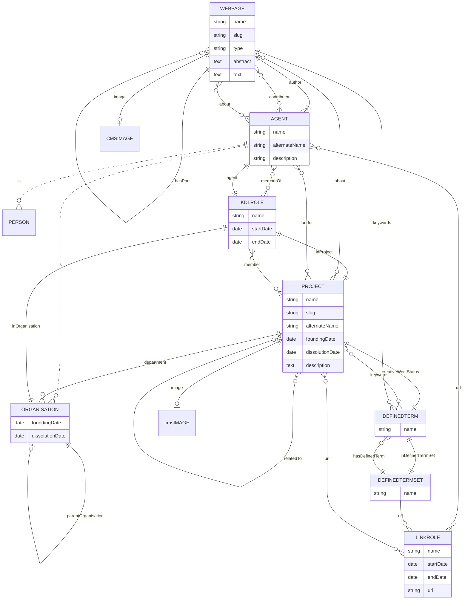

# KDL Web Project

## Set up

### Dependencies

- [Docker](https://www.docker.com/)
- [Node](https://nodejs.org/) 16

Install the node packages:

    npm install

Install the git hooks:

    npx simple-git-hooks

### CMS module

Set up Docker:

    cp docker-compose.override.yaml.example docker-compose.override.yaml

Set up the environment files:

    cd .envs
    cp .cms.example .cms
    cp .database.example .database
    cp .etl.example .etl

Run the stack:

    npm run up

The cms is available at <http://localhost:8055/> by default and if no port configuration
changed.

#### Data model versioning

Create a snapshot:

    npm run cms:snapshot

Apply a snapshot:

    npm run cms:snapshot:apply --snapshot=SNAPSHOT_NAME

Where `SNAPSHOT_NAME` is the name of the snapshot without path or extension. By default
the data model snapshots are saved in [cms/snapshots](cms/snapshots/README.md).

### Data model

This data model is based on the [schema.org](https://schema.org/) vocabulary.
Local customisations are prefixed with `KDL` and models internal to the CMS
are prefixed with `CMS`.

