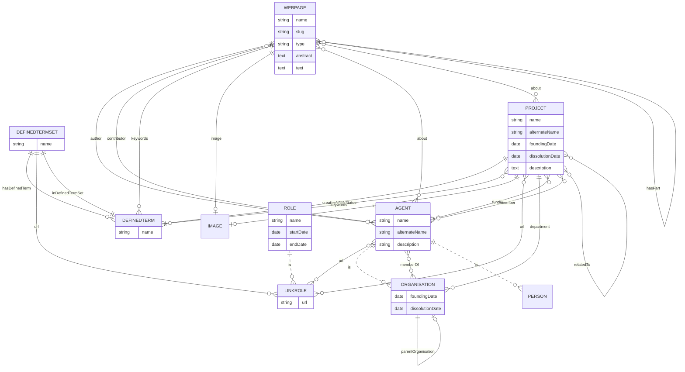

# KDL Web Project

## Set up

### Backend

Set up [Docker](https://www.docker.com/):

    cp docker-compose.override.yaml.example docker-compose.override.yaml

Set up the environment files:

    cd .envs
    cp .backend.example .backend
    cp .database.example .database

Run the backend:

    npm run backend:up

The backend is available at http://localhost:8055/ by default and if no port
configuration was changed.

#### Data model versioning

Create a snapshot:

    npm run backend:snapshot

Apply a snapshot:

    npm run backend:snapshot:apply --snapshot=SNAPSHOT_NAME

Where `SNAPSHOT_NAME` is the name of the snapshot without path or extension. By default
the data model snapshots are stored at [backend/snapshots](backend/snapshots/README.md).

### Data model

This data model is based on the [schema.org](https://schema.org/) vocabulary.

